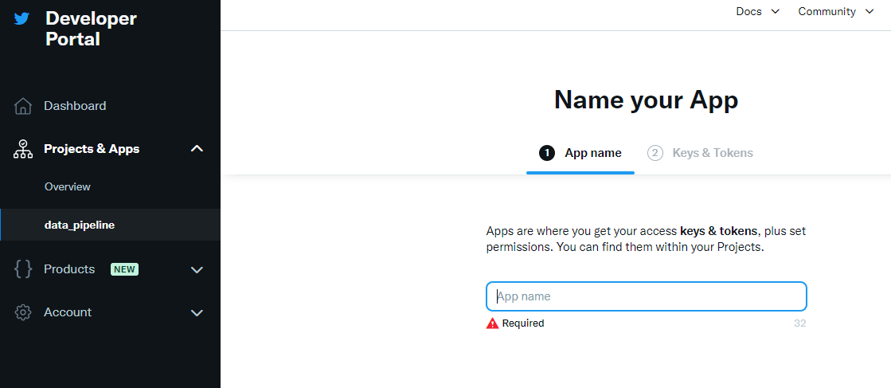
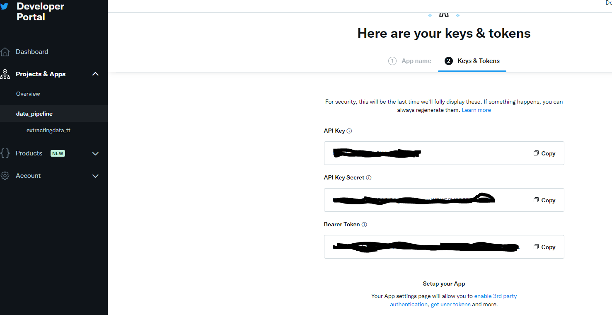

# Goal
Creating a data pipelines extracting data from Twitter, using apache airflow, passing to Data Lake. Then, use spark for extract raw data from data lake, transforme them and loading in data lake again.

# Data origin
They from Twitter. In other words, it will be necessary to create Twitter developer account for getting access to data.

Website: https://developer.twitter.com/en

### Using Twitter API

    1º Step: Let's go to Twitter developer website. Then, create a user and justify because they are 
    education goals. 

    2° Step: After that, you'll create a new project in Dashboard part - without him, you won't 
    make a new application.
    
    3° Step: Creating an Application, define your app name and getting keys (API key, API key 
    Secret and Bearer Token). Finally, key save your keys.

    note: When you create your keys, that's the only one moment you'll see them. If you forget, 
    you'll need delete your app and create new one. I recommend you creating a .txt file with your 
    keys and save it in your local folder, but don't forget put in gitignore file too.

#### Creating APP

#### Getting API Keys

### Operation System

     I'll use ubuntu. If your system isn't based in unix 
     like linux or mac and you're using windows. So, it
     will be necessary install VMware for install and config an
     Operation System based on Unix.

Note: 
https://medium.com/thesecmaster/step-by-step-procedure-to-install-ubuntu-linux-on-vmware-workstation-18054864537b

### Installing Python3

    Download: 
        In python.org (https://www.python.org/downloads/), you can see every activate version for languague. Then download now Python-3.10.12.tgz. 
        After that, create new global variables

    Envorinment variables:
        export PYTHON_VERSION=3.10.12
        export PYTHON_MAJOR=3

    Extracting Tgz file:
        tar -xvzf Python-${PYTHON_VERSION}.tgz
        cd Python-${PYTHON_VERSION}

    Configure Installation:
        ./configure \
            --prefix=/opt/python/${PYTHON_VERSION} \
            --enable-shared \
            --enable-optimizations \
            --enable-ipv6 \
            LDFLAGS=-Wl,-rpath=/opt/python/${PYTHON_VERSION}/lib,--disable-new-dtags

    Install:
        make
        sudo make install

    Making new version default (Optinal):
        cd /opt/python/${PYTHON_VERSION}/bin
        sudo ln -s python3.10.12 python
        echo "PATH=/opt/python/3.10.12/bin/:$""PATH" >> ~/.profile
        .~/.profile

    Verify the Installation version:
        python3 --version

NOTE: 
https://medium.com/@lupiel/installing-python-from-a-tgz-file-a-step-by-step-guide-4cf5f4a17a86

### Installing pip

    Install: 
        $python get-pip.py
    Upgrade: 
        python -m pip install --upgrade pip

### Installing Airflow

    Envorinment variables:
        export AIRFLOW_HOME=$(pwd)/airflow
        export AIRFLOW_VERSION=2.7.3
        export PYTHON_VERSION="$(python --version | cut -d " " -f 2 | cut -d "." -f 1-2)"
        export CONSTRAINT_URL="https://raw.githubusercontent.com/apache/airflow/constraints-${AIRFLOW_VERSION}/constraints-${PYTHON_VERSION}.txt"
    
    Install using constraints file:
        pip install "apache-airflow==${AIRFLOW_VERSION}" --constraint "${CONSTRAINT_URL}"
    
    Initialize:
        1° The database and create user with all components:
            airflow standalone

        2° If you want Run all individuals parts one-by-one:
            airflow db migrate

            airflow db init

            airflow users create \
                --username USERNAME \
                --firstname FIRSTNAME \
                --lastname LASTNAME \
                --role Admin \
                --email example@gmail.com
            
            airflow webserver --port 8080

            airflow scheduler
    
    Finish process in port:
        fuser -k 8080/tcp

# Connecting Twitter

    Envorinment variables:
        export BEARER_TOKEN=your_bearer_token_keys

    How connect:
        https://github.com/twitterdev/Twitter-API-v2-sample-code/blob/main/Recent-Search/recent_search.py

## Technologies Used
- Twitter API
- linux ubuntu 22.04
- pip package version
- Python3.10.12
- Apache Aiflow 2.7.3
- Spark 